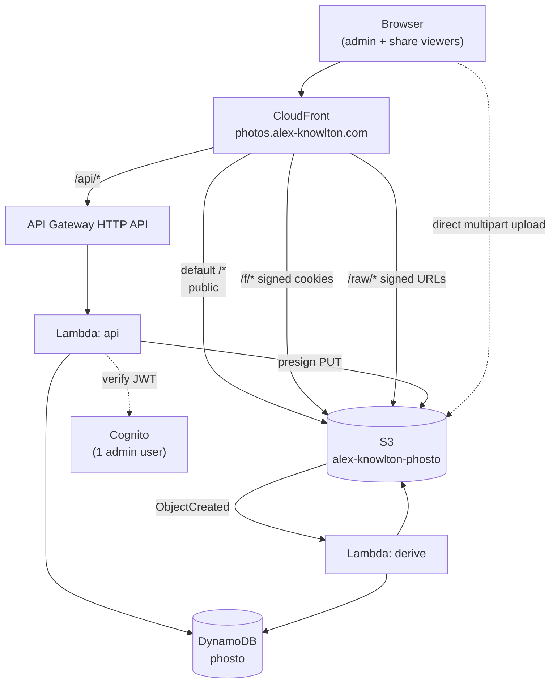

# Architecture

## Goals

1. Upload JPEG / PNG / HEIC *and* RAW, where RAW is hidden by default and revealed
   by a toggle.
2. Group photos into folders.
3. Share a folder with someone who does not have an account.
4. Stay cheap and stay private — nothing readable without a signature.

## Diagram



## S3 layout

```
/                                    static site (index.html, assets/…)
f/<folderId>/<photoId>/thumb.webp    ~400px   — grid
f/<folderId>/<photoId>/medium.webp   ~1200px  — lightbox
f/<folderId>/<photoId>/large.webp    ~2400px  — zoom
orig/<folderId>/<photoId>.jpg        as uploaded — download only
raw/<folderId>/<photoId>.RAF         as uploaded — lifecycle → Glacier IR at 30d
```

Putting `folderId` in the key path is what makes sharing enforceable: a signed
cookie with resource `https://photos.alex-knowlton.com/f/<folderId>/*` grants
exactly one folder and nothing else.

Three separate prefixes, for two reasons:

1. **Share cookies cannot reach originals or RAWs.** A cookie scoped to `f/<id>/*`
   structurally excludes `orig/` and `raw/`, regardless of how the API behaves.
   Downloading either is a one-off signed URL, issued per object, only when the
   share has `allowDownload` / `allowRaw`.
2. **No notification loop.** The derive Lambda listens on `orig/` and `raw/` and
   writes to `f/`. If derivatives shared a prefix with their inputs, every write
   would retrigger the function.

## CloudFront behaviors

| Path | Origin | Access |
|---|---|---|
| `api/*` | API Gateway | no cache, forwards Authorization |
| `f/*` | S3 (OAC) | **trusted key group** — signed cookies |
| `orig/*` | S3 (OAC) | **trusted key group** — signed URLs only |
| `raw/*` | S3 (OAC) | **trusted key group** — signed URLs only |
| `*` | S3 (OAC) | public — the static site |

## DynamoDB single table

| Entity | PK | SK | GSI1PK | GSI1SK |
|---|---|---|---|---|
| Folder | `FOLDER#<id>` | `META` | `ROOT` | `<createdAt>#<id>` |
| Photo | `FOLDER#<id>` | `PHOTO#<takenAt>#<photoId>` | — | — |
| Share | `SHARE#<tokenHash>` | `META` | `FOLDER#<id>` | `SHARE#<createdAt>` |

Share tokens are stored **hashed** (SHA-256), so a table dump does not hand over
working share links. `expiresAt` is a DynamoDB TTL attribute, so expired shares
delete themselves.

## Auth

- **Admin** — Cognito user pool with exactly one user. The API validates the JWT.
  Admin session also mints signed cookies scoped to `/f/*` so the admin can see
  every folder.
- **Viewer** — no account. `GET /api/share/{token}` validates the token, then sets
  signed cookies scoped to that one folder's prefix. Nothing else is reachable.

## Derivative pipeline

Triggered by S3 `ObjectCreated` under `f/*/original.*` and `raw/*`.

| Input | How a preview is produced |
|---|---|
| JPEG / PNG / WebP | `sharp` directly |
| HEIC / HIF | `libheif-js` (wasm) decode → `sharp` |
| Fujifilm RAF | embedded full-size JPEG, read via two S3 range requests |
| Other RAW (CR2/NEF/ARW/DNG) | stored, but no preview unless a JPEG sibling exists |

The RAF path is worth calling out: the RAF header stores the embedded JPEG's offset
at byte 84 and its length at byte 88, both big-endian `uint32`. So the Lambda reads
96 bytes, then ranges in on exactly the embedded JPEG — it never downloads the full
30 MB file. See [functions/derive/raf.ts](../functions/derive/raf.ts).

## Pairing RAW with JPEG

`XT300024.JPG` and `XT300024.RAF` become **one** photo with `hasRaw: true`, matched
by basename. A RAW with no JPEG sibling becomes its own photo, previewed from its
embedded JPEG. The `hasRaw` flag is what the "show RAWs" toggle filters on.
